

  

    
Research internship / talent program interview

    <h1>Building Universal Digital Agents That Learn, Remember, and Act</h1>
    
Using real GUI environments to study agent learning, self-improvement, memory, and reliable long-horizon autonomy.

    

      Guangyi Liu (刘广义)
      Ph.D. Candidate, Zhejiang University
      Expected 2028.06
    

  

  

    

      
    

    

      <b>Research focus</b>
      Universal Digital Agents
      Agent Learning · Memory · Evaluation
    

  

---
section: Overview
---

# Candidate Snapshot

  

    

      
      

        <h2>Guangyi Liu (刘广义)</h2>
        
Ph.D. Candidate in Control Science and Engineering

        
<b>Zhejiang University · ZJU APRIL Lab</b>

      

    

    
I study the foundations of <b>universal digital agents</b>: systems that understand digital environments, adapt through interaction, and reliably assist people across apps, devices, and software workflows.

    
<b>Advisors</b>Prof. Yong Liu · Prof. Jiangning Zhang · Dr. Liang Liu

    
<b>Service</b>ICML 2026 Silver Reviewer · Reviewer for ICLR, NeurIPS, ICML, ECCV, ACM MM, EMNLP, TMLR

  

  

    
5first-author works

    
415Google Scholar citations

    
122first-author citations

    
632first-author project stars

    
Metrics updated 2026.08.09

  

---

# Research Experience: From Prototypes to Real Systems

  

    

      
      
<h3>Kuaishou Technology</h3>Research Intern · Hangzhou · 2025.08–2026.07

    

    
<b>Mentor:</b> Martin Li

    
Built research prototypes for agent post-training and long-horizon context management, and contributed to internal GUI-agent systems for app defect detection.

  

  

    

      
      
<h3>vivo AI Lab</h3>Research Intern · Hangzhou · 2024.08–2025.08

    

    
<b>Mentors:</b> Dr. Liang Liu and Prof. Hongsheng Li

    
Worked on demonstration learning, online evaluation, and memory-centric benchmarking; contributed to vivo PhoneGPT, a general-purpose phone GUI agent.

  

  <b>Research</b> formulate questions and validate ideas
  <b>Engineering</b> build environments, data pipelines, and evaluators
  <b>Application</b> connect agent research to real product workflows

---

# My Research Thesis

  

    Long-term goal
    <h2>Universal digital agents should improve through interaction while remaining reliable over long horizons.</h2>
    
Mobile GUIs are my current proving ground: they expose dynamic interfaces, sparse feedback, hidden state, long-tail workflows, and deployment constraints in one environment.

  

  

    
<b>Learn</b>demonstrations, feedback, RL, post-training

    
<b>Remember</b>context control, experience reuse, continual adaptation

    
<b>Evaluate</b>online protocols, interpretable metrics, failure diagnosis

    
<b>Act</b>grounded tool use across apps and software workflows

  

---

# What I Build End to End

  
01<b>Environment</b>
Target-app exploration, task execution, resets, and interaction logging.

  
02<b>Data</b>
Human demonstrations, self-collected rollouts, feedback, hints, and memory traces.

  
03<b>Policy</b>
Prompted agents, SFT, reinforcement learning, and context-management actions.

  
04<b>Evaluation</b>
Online task success, pass@k, progressive scrutiny, and failure taxonomies.

  
05<b>System</b>
Reproducible pipelines that connect exploration, learning, evaluation, and deployment.

<b>My working style:</b> identify a capability bottleneck, build the substrate that makes it measurable, then close the loop with data and policy improvement.

---

# Research Arc: One Question, Five Steps

  

    01
    <b>Understand the field</b>
    
Build a technical map of frameworks, data, evaluation, and open problems.

  

  

    02
    <b>Learn from examples</b>
    
Use a few human examples to adapt to unseen apps and long-tail workflows.

  

  

    03
    <b>Measure memory</b>
    
Turn short- and long-term memory into measurable agent capabilities.

  

  

    04
    <b>Adapt without labels</b>
    
Convert exploration, rollouts, hierarchical feedback, and hints into policy updates.

  

  

    05
    <b>Build memory into the policy</b>
    
Make proactive context management a learnable part of an end-to-end policy.

  

The through-line: move from describing the field to building agents that can adapt, retain experience, and execute reliably.

---
layout: intro
section: Survey
---

# 01. Surveying the Field

LLM-Powered GUI Agents in Phone Automation: Surveying Progress and Prospects

TMLR 2025 · 64 citations · 175 GitHub stars

---

# Why Phone GUI Agents Matter

  

    
Traditional automation is brittle: scripts fail under app updates, dynamic layouts, and ambiguous user intent.

    

      <b>Key shift</b>
      
LLM-powered phone agents combine natural language understanding, multimodal perception, reasoning, and executable UI actions.

    

    <ul class="clean-list">
      <li>From static scripts to adaptive perception-action loops.</li>
      <li>From single-step UI grounding to task-level mobile workflows.</li>
      <li>From benchmark demos to privacy, reliability, and on-device deployment questions.</li>
    </ul>
  

  

    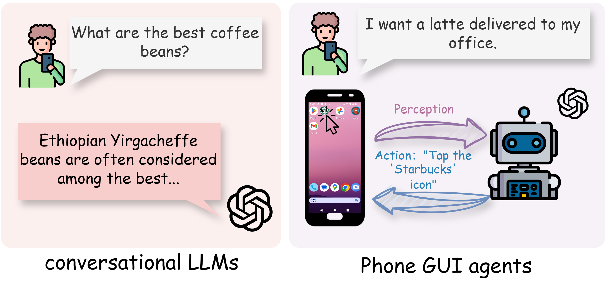
    
Conversational LLMs answer. GUI agents perceive, decide, and act.

  

---

# A Technical Map for the Area

  

    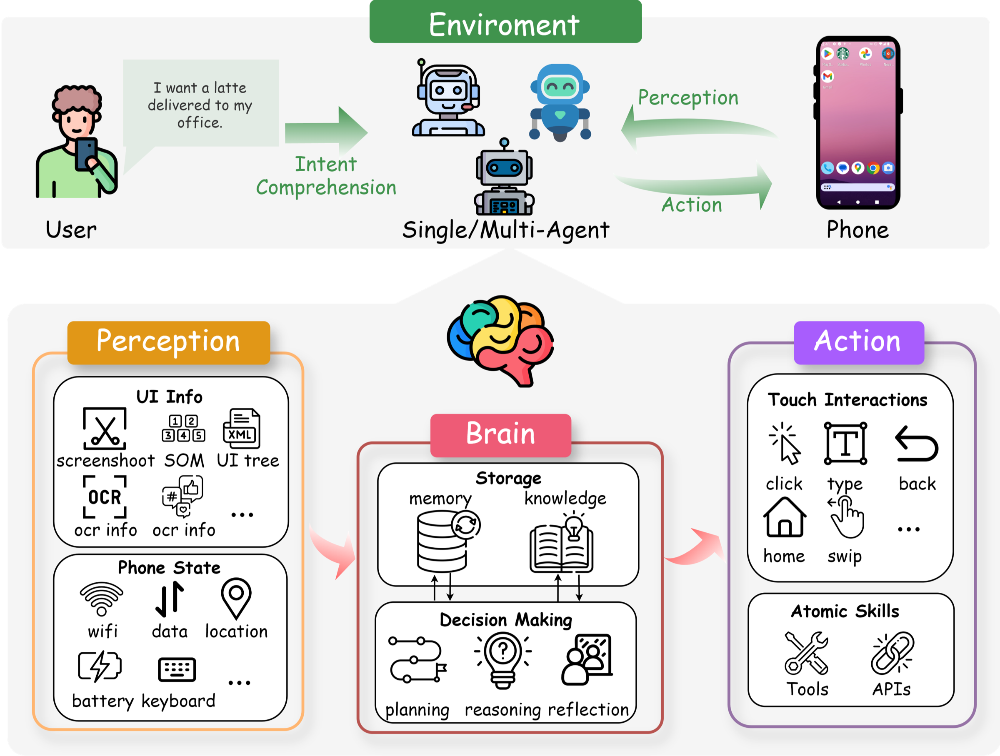
  

  

    

      
<b>Frameworks</b>Single-agent, multi-agent, plan-then-act, perception-brain-action pipelines.

      
<b>Models</b>Prompting, SFT, RL, multimodal grounding, task-specific action heads.

      
<b>Data and evaluation</b>GUI traces, screenshots, UI trees, online task success, robustness metrics.

      
<b>Open problems</b>Long-horizon planning, memory, security, efficiency, personalization.

    

  

---

# What the Survey Contributed to My Research Base

  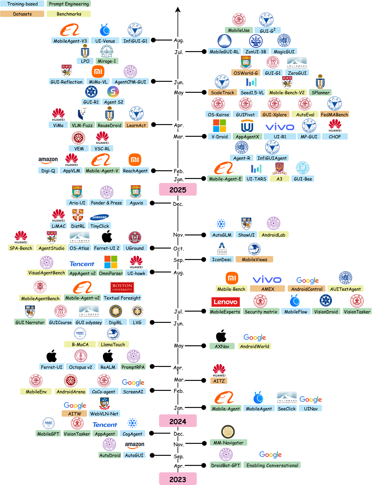
  

    <h3>Research value</h3>
    
The survey gave me a structured vocabulary for later work: framework design, data design, evaluation, training, and deployment constraints.

    

      Field taxonomy
      Dataset and benchmark gaps
      Future directions: memory, user adaptation, safety
    

  

---
layout: intro
section: LearnAct
---

# 02. Few-Shot Demonstration Learning

LearnAct: Few-Shot Mobile GUI Agent with a Unified Demonstration Benchmark

ACL 2026 · 40 citations · 48 GitHub stars

---

# Core Problem: The Personalization Gap

  

    
Mobile apps and user workflows are too diverse for a single pretraining or fine-tuning corpus to cover.

    

      

        <b>Problem</b>
        
Agents fail in long-tail apps, personalized settings, and unseen task variants.

      

      

        <b>Idea</b>
        
Let the agent learn from a few human demonstrations and retrieve task-relevant procedural knowledge.

      

    

    
<b>Research question</b>Can a mobile agent convert only a few human trajectories into reusable knowledge for unseen tasks and apps?

    

      
<b>2,252</b>offline tasks

      
<b>101</b>online tasks

      
<b>3</b>agent modules

    

  

  

    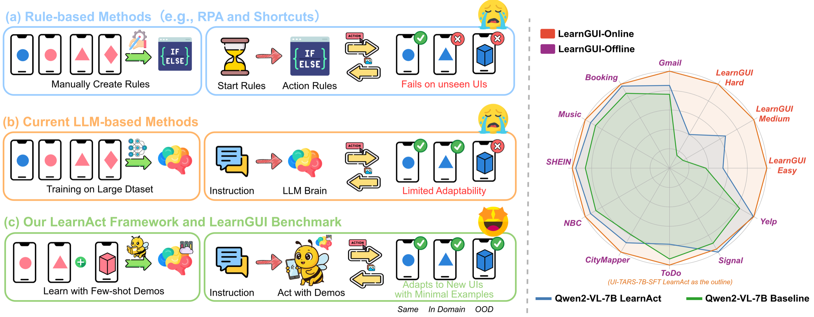
  

---

# LearnAct: Extract, Retrieve, Execute

  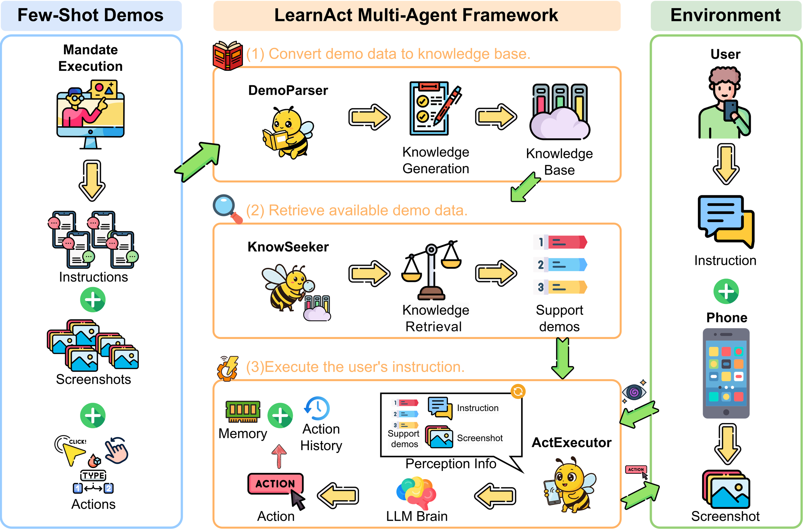
  

    <b>DemoParser</b> turns trajectories into reusable knowledge.
    <b>KnowSeeker</b> retrieves relevant knowledge for the current task.
    <b>ActExecutor</b> executes with task, screen, and retrieved demonstrations.
  

---

# Results: A Few Examples Can Move the Needle

  

    19.3% -> 51.7%
    <b>Gemini-1.5-Pro offline accuracy</b>
    
One demonstration produced a 198.9% relative gain.

  

  

    18.1% -> 32.8%
    <b>UI-TARS-7B-SFT online success</b>
    
LearnAct nearly reached GPT-4o with a much smaller open model.

  

  

    +14.7 pp
    <b>End-to-end task success gain</b>
    
Demonstration learning transfers from offline step quality to online interaction.

  

  <b>Takeaway:</b> Personalization can be framed as knowledge extraction and retrieval, not only as more model scaling.

---

# What LearnAct Taught Me

  

    <b>Data design</b>
    
A benchmark must separate offline step matching from online task completion to reveal what demonstrations really teach.

  

  

    <b>Agent decomposition</b>
    
Specialized sub-agents can make knowledge more explicit, interpretable, and reusable.

  

  

    <b>Retrieval matters</b>
    
Relevant examples are not just prompt context; they become procedural scaffolding.

  

  

    <b>Open issue</b>
    
Demonstrations help adaptation, but they do not yet solve memory-intensive long-horizon reliability.

  

  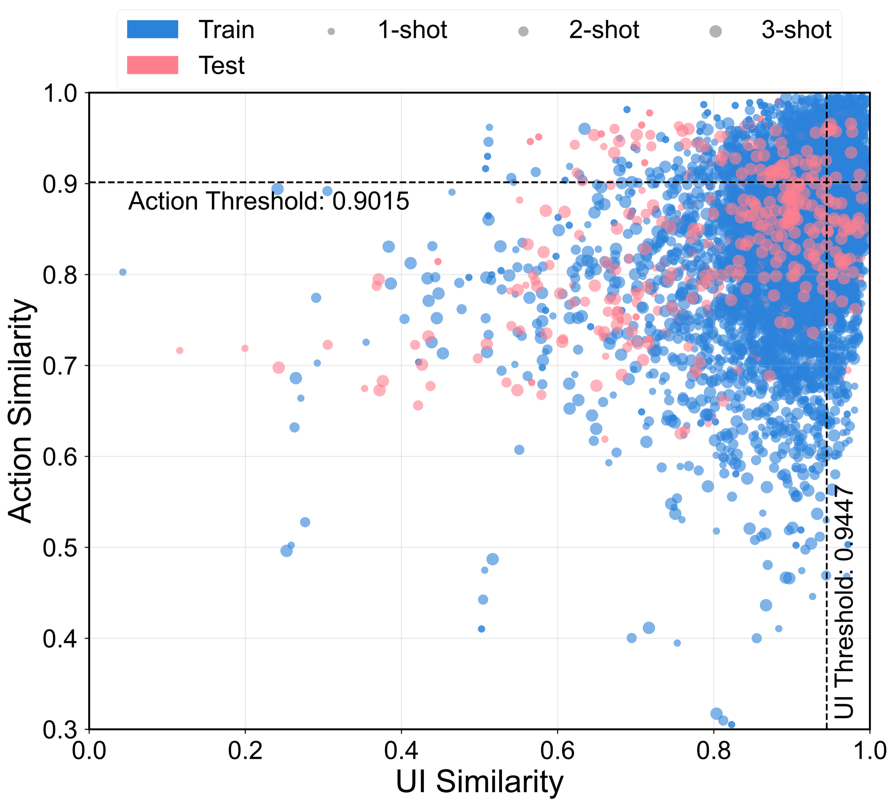

---
layout: intro
section: MemGUI-Bench
---

# 03. Benchmarking Memory

MemGUI-Bench: Benchmarking Memory of Mobile GUI Agents in Dynamic Environments

ACM MM 2026 · 17 citations · 48 GitHub stars

---

# Core Problem: Existing Benchmarks Under-Test Memory

  

    
Mobile tasks carry facts across screens, apps, and attempts, but prior benchmarks contain few memory-intensive tasks.

    

      
<b>128</b>tasks

      
<b>26</b>apps

      
<b>89.8%</b>memory-challenging tasks

    

    <ul class="clean-list compact-list">
      <li><b>Short-term memory:</b> retain and use facts within one task.</li>
      <li><b>Long-term memory:</b> improve across attempts; pass@1 vs. pass@k separates execution from experience reuse.</li>
    </ul>
    
<b>Research question</b>How can we isolate, measure, and diagnose memory in dynamic mobile environments?

  

  

    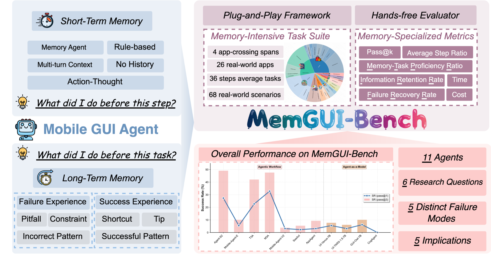
  

---

# MemGUI-Bench as an Evaluation Substrate

  

    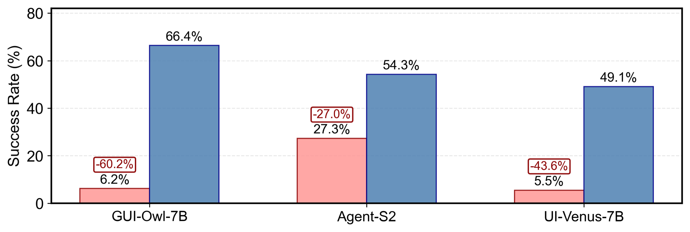
  

  

    

      
<b>Task construction</b>Cross-temporal and cross-spatial information retention.

      
<b>Agent coverage</b>11 systems spanning agentic workflows and end-to-end models.

      
<b>Metrics</b>Success rate, information retention, memory-task proficiency, forgetting.

      
<b>Goal</b>Expose what standard UI automation benchmarks hide.

    

  

---

# MemGUI-Eval: Progressive Scrutiny

  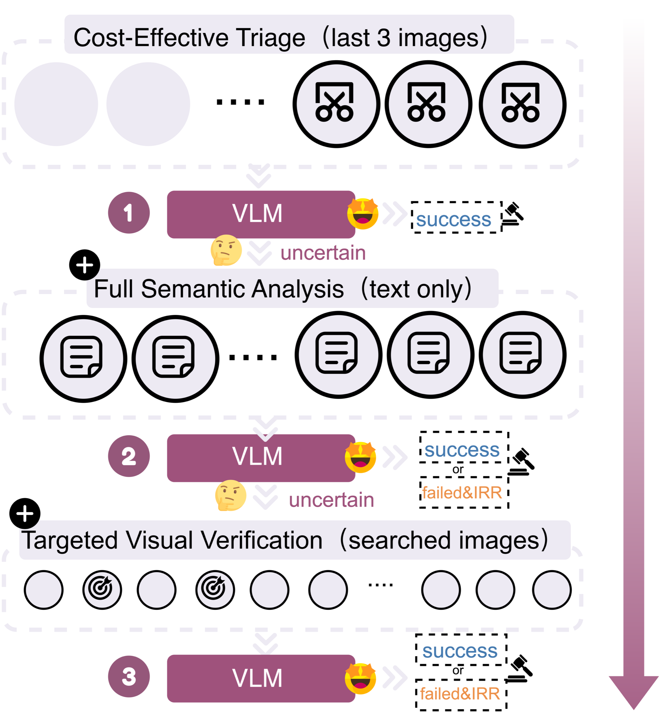
  

    Stage 1: low-cost final-screen triage.
    Stage 2: semantic trajectory analysis.
    Stage 3: targeted visual evidence retrieval.
  

---

# Main Findings

  

    <b>Capability gap</b>
    
Agents show 4-10x gaps on memory-intensive tasks compared with easier UI control settings.

  

  

    <b>Memory helps</b>
    
Long-context brings +18.8 pp; long-term memory brings +21.9 pp in controlled studies.

  

  

    <b>Cross-app hurts</b>
    
Cross-app complexity causes 16-40 pp degradation.

  

  

    <b>Failures are structured</b>
    
Seven failure categories, including five memory-specific modes, turn scores into design targets.

  

  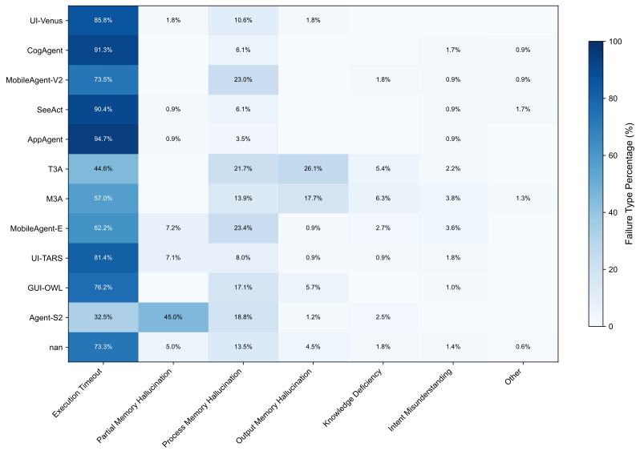

---

# Why This Changed My Research Direction

  

    <h2>Memory is not a prompt detail.</h2>
    
It is a capability that needs task design, metrics, evaluator design, and architectural support.

  

  

    
<b>Before MemGUI-Bench</b>Measure whether agents can finish tasks.

    
<b>After MemGUI-Bench</b>Measure what they remembered, forgot, compressed, transferred, and learned.

  

---
layout: intro
section: MobileForge
---

# 04. Annotation-Free Adaptation

MobileForge: Annotation-Free Adaptation for Mobile GUI Agents with Hierarchical Feedback-Guided Policy Optimization

Preprint 2026 · 76 GitHub stars · Covered by Synced China

---

# Core Problem: Adaptation Data Is Expensive and Stale

  

    
Real mobile apps change constantly. Human-written tasks, demonstrations, and reward labels are costly and become stale quickly.

    

      

        <b>Bottleneck 1</b>
        
No unified substrate connecting app exploration, curriculum mining, rollout execution, and evaluation.

      

      

        <b>Bottleneck 2</b>
        
Isolated rollouts with sparse rewards do not give reliable long-horizon credit assignment.

      

    

    
<b>Research question</b>Can agents ground tasks in target apps, generate fine-grained feedback, and improve from self-collected experience without human annotations?

  

  

    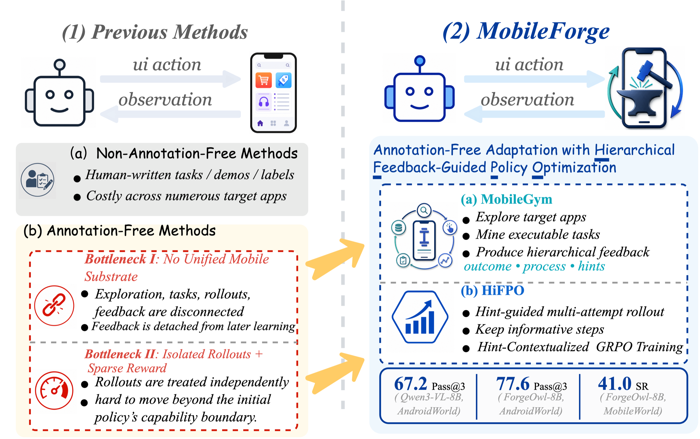
  

---

# MobileGym: Ground Tasks in Real App Interaction

  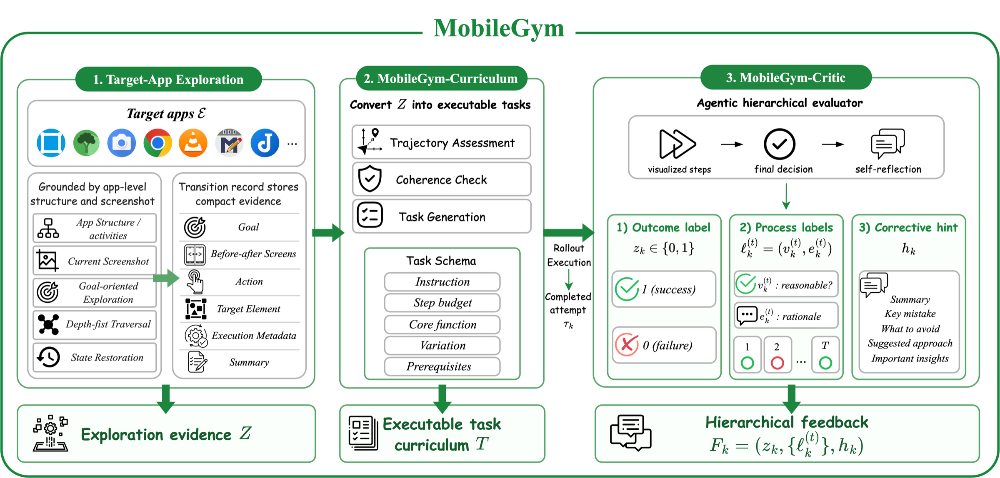
  

    Explore target apps.
    Mine executable curriculum tasks.
    Evaluate rollouts with outcome, process, and hint feedback.
  

---

# MobileForge System Loop

  

    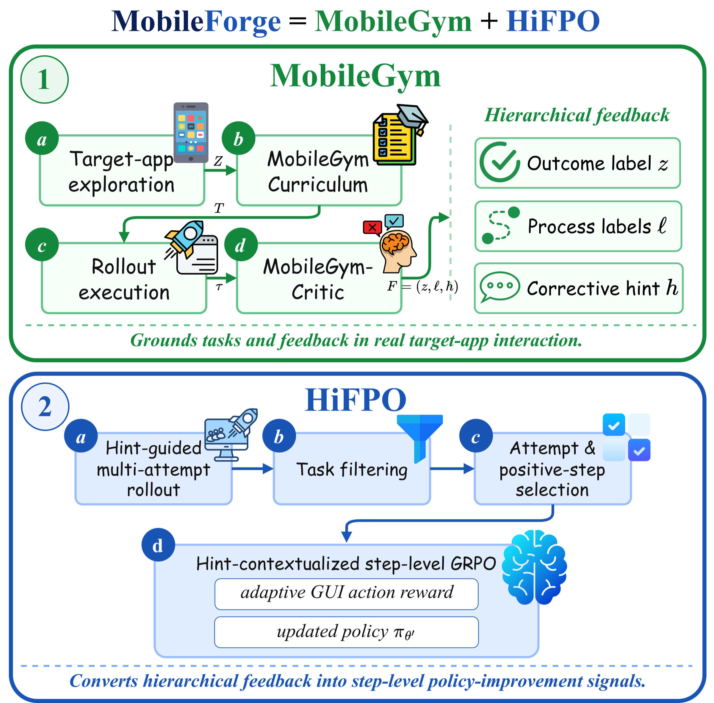
  

  

    
The system creates its own adaptation loop without human task labels.

    

      
<b>Explore</b>Collect reachable screens and UI functions.

      
<b>Curriculum</b>Generate app-grounded tasks.

      
<b>Rollout</b>Run multiple attempts with evolving hints.

      
<b>Optimize</b>Select reasonable steps and train with GRPO.

    

  

---

# HiFPO: Turn Feedback into Policy Updates

  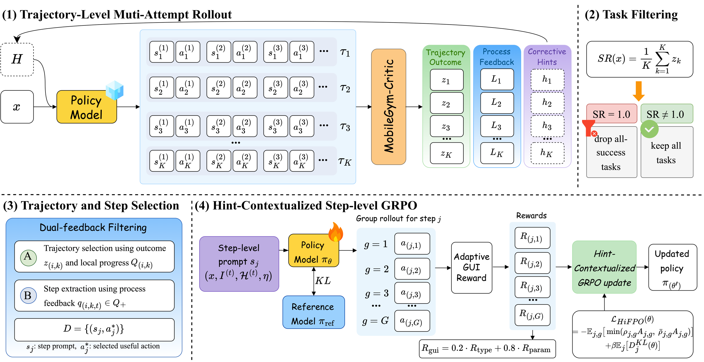
  

    Multi-attempt feedback is accumulated as hints.
    Mastered tasks are filtered out.
    Useful local steps are converted into hint-contextualized GRPO data.
  

---

# MobileForge Results

  

    

      55.2% -> 67.2%
      <b>Qwen3-VL-8B AndroidWorld Pass@3</b>
      
Annotation-free adaptation narrows the gap to GUI-specialized agents.

    

    

      69.0% -> 77.6%
      <b>GUI-Owl-1.5-8B AndroidWorld Pass@3</b>
      
MobileForge also improves already strong GUI-specialized agents.

    

    

      41.0%
      <b>ForgeOwl-8B MobileWorld GUI-only</b>
      
Strongest open-data mobile GUI agent in the evaluation.

    

  

  

    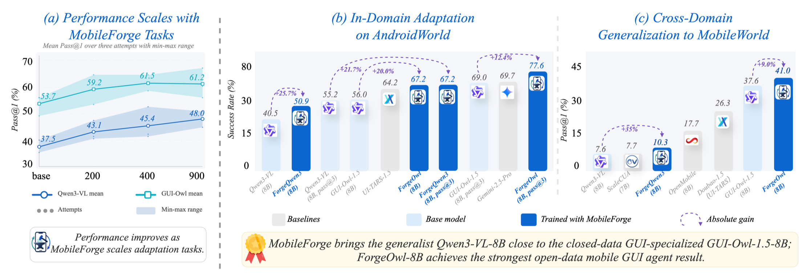
  

---

# Insight: Evaluation Becomes Part of Learning

  
1<b>Explore</b>
Discover reachable app states and functions.

  
2<b>Challenge</b>
Generate curricula near the current capability frontier.

  
3<b>Diagnose</b>
Combine outcomes, process feedback, and corrective hints.

  
4<b>Improve</b>
Turn useful local decisions into policy updates.

  

    <h2>A data flywheel needs more than reward.</h2>
    
Task generation, rollout evaluation, failure analysis, and policy optimization must share the same grounded environment.

  

  

    
<b>Contribution</b>MobileGym + HiFPO form an annotation-free adaptation substrate.

    
<b>General insight</b>Evaluator design determines what experience an agent can learn from.

  

---
layout: intro
section: MemGUI-Agent
---

# 05. End-to-End Long-Horizon Agents

MemGUI-Agent: An End-to-End Long-Horizon Mobile GUI Agent with Proactive Context Management

Preprint 2026 · 88 GitHub stars · Covered by QbitAI

---

# Core Problem: ReAct-Style Context Breaks Down

  

    
Long-horizon mobile tasks require agents to keep exact facts, track progress, and move information across apps.

    

      

        <b>Prompt explosion</b>
        
Passive history accumulation makes prompts grow with task horizon.

      

      

        <b>Information loss</b>
        
Critical prices, names, identifiers, and copied content get diluted or truncated.

      

    

    

      <b>Question:</b> Can the same policy choose UI actions and manage its own working context?
    

  

  

    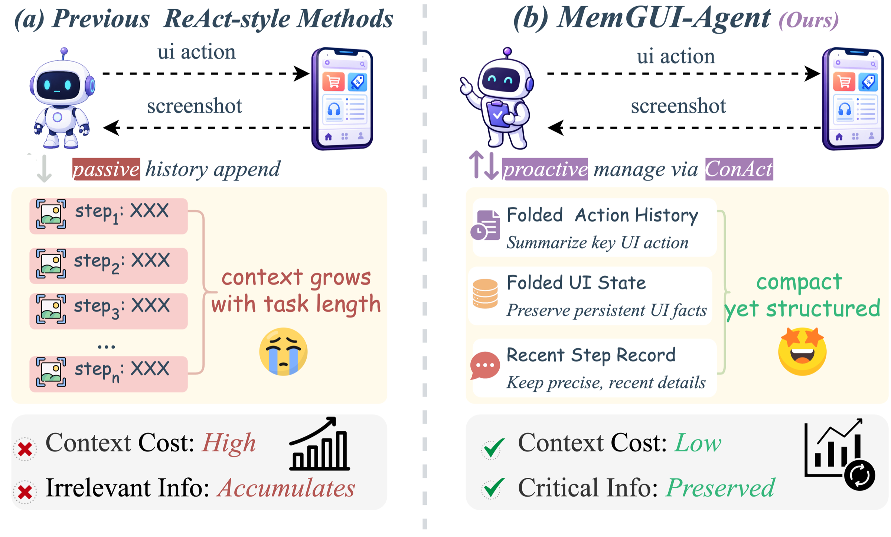
  

---

# ConAct: Context-as-Action

  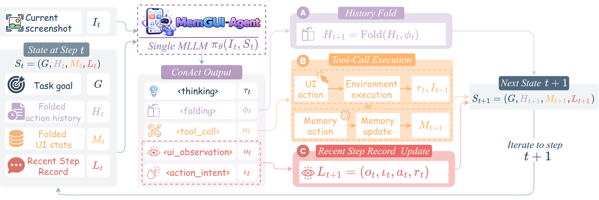
  

    Folded action history stores compressed trajectory summaries.
    Folded UI state stores persistent UI-derived facts.
    Recent step records make future folding and memory writes grounded.
  

---

# A 5-Part Step Output Protocol

  
1<b>&lt;thinking&gt;</b>
Reason about task progress and the current UI.

  
2<b>&lt;folding&gt;</b>
Compress old history into a reusable summary.

  
3<b>&lt;tool_call&gt;</b>
Execute a UI action or update memory.

  
4<b>&lt;ui_observation&gt;</b>
Record exact visible task-relevant facts.

  
5<b>&lt;action_intent&gt;</b>
Describe why the current action was taken.

  <b>Design principle:</b> context management should be policy-level behavior, not an external summarizer bolted onto the loop.

---

# MemGUI-3K: Learning Proactive Context Management

  

    
MemGUI-3K provides full ConAct annotations so smaller models can learn proactive context management.

    

      
<b>2,956</b>trajectories

      
<b>26</b>apps

      
<b>28.8</b>average steps

    

    <ul class="clean-list">
      <li>Captures long-horizon GUI behavior with memory actions.</li>
      <li>Separates span-level abstraction from step-level distillation.</li>
      <li>Supports supervised training and offline context analysis.</li>
    </ul>
  

  

    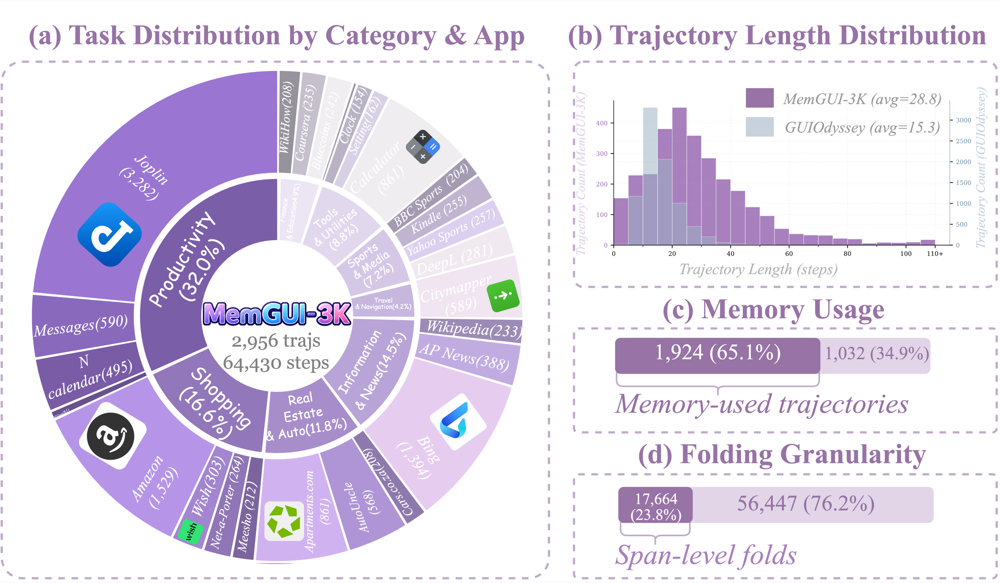
  

---

# MemGUI-Agent Results

  

    

      62.5%
      <b>Pass@3 on MemGUI-Bench</b>
      
Zero-shot ConAct on Qwen3-VL-235B-Thinking sets the top result in this benchmark.

    

    

      23.4% / 35.9%
      <b>MemGUI-8B-SFT Pass@1 / Pass@3</b>
      
Best open-data 8B performance on MemGUI-Bench.

    

    

      29.1%
      <b>MobileWorld GUI-only</b>
      
ConAct generalizes to out-of-distribution long-horizon tasks.

    

  

  

    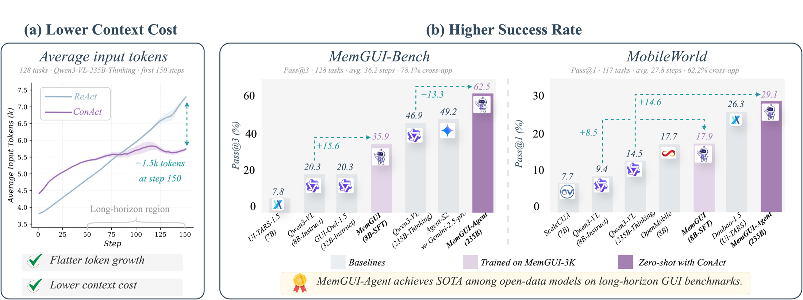
  

---

# Qualitative Evidence: Keeping Facts Alive

  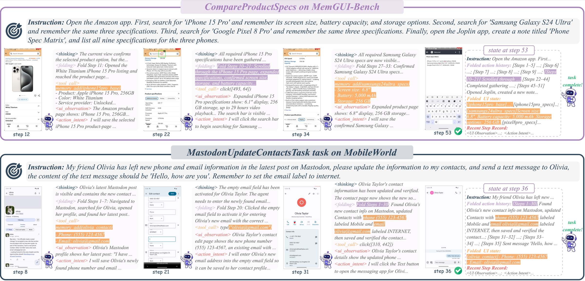

---

# Insight: Memory Must Change Future Action

  

    Core principle
    <h2>Useful memory is not stored text. It is information the policy can decide to write, compress, retrieve, and act on.</h2>
  

  

    
<b>Policy ownership</b>
The agent, not an external heuristic, decides when context should change.

    
<b>Structured supervision</b>
Step intent and UI facts make context actions trainable and auditable.

    
<b>Transfer</b>
A memory protocol learned on one benchmark can generalize to new long-horizon tasks.

  

---
layout: intro
section: Synthesis
---

# Synthesis

From five projects to a reusable research and engineering stack

---

# A Coherent Technical Stack

  
Survey<b>Problem framing</b>
Taxonomy, trends, capability gaps, and research questions.

  
LearnAct<b>Few-shot learning</b>
Demonstration parsing, retrieval, and action execution.

  
MemGUI-Bench<b>Evaluation science</b>
Memory-centric task design and progressive LLM-as-judge.

  
MobileForge<b>Training loop</b>
Annotation-free task generation, feedback, hints, and GRPO.

  
MemGUI-Agent<b>Agent architecture</b>
Context-as-Action and learned proactive context management.

---

# How I Can Contribute to an Industry Research Team

  

    <h3>Own the full research loop</h3>
    
Move from question formulation to environment construction, data generation, model training, evaluation, and analysis.

  

  

    <h3>Build reliable agent infrastructure</h3>
    
Develop interaction environments, scalable rollout pipelines, trajectory tooling, and automated evaluators for real applications.

  

  

    <h3>Turn failures into training signals</h3>
    
Translate agent errors into benchmarks, feedback, curricula, SFT data, and reinforcement-learning objectives.

  

  

    <h3>Bridge research and deployment</h3>
    
Work across research prototypes and real product workflows, with experience at vivo AI Lab and Kuaishou Technology.

  

<b>Best fit:</b>computer-use agentsagent post-trainingself-evolving systemsmemory and long-horizon autonomyagent evaluation

---

# Research Agenda: Beyond Mobile Apps

  

    <b>1. Universal action models</b>
    
Transfer perception, reasoning, and tool-use policies across mobile, web, desktop, and hybrid software workflows.

  

  

    <b>2. Verifiable self-evolution</b>
    
Use grounded exploration, adaptive curricula, and hierarchical critics so improvement is continuous and measurable.

  

  

    <b>3. Experience-native memory</b>
    
Unify working context, episodic experience, skill abstraction, retrieval, and forgetting inside the agent loop.

  

  

    <b>4. Trustworthy digital autonomy</b>
    
Treat verification, privacy, controllability, cost, and human oversight as first-order research variables.

  

Mobile GUI agents are the starting point, not the boundary: the broader target is reliable agency across the digital world.

---

# Why This Research Direction Matters

  
My research thesis

  <h1>The next useful agents will not only follow instructions. They will learn from interaction, preserve the right experience, and improve safely in the environments where people work.</h1>
  
My five first-author projects build toward that goal through problem framing, demonstration learning, memory evaluation, annotation-free post-training, and context-native agent architecture.

  

    Strong research questions
    End-to-end execution
    Evidence-driven iteration
    Research-to-product experience
  

  
<b>Guangyi Liu</b>guangyiliu@zju.edu.cnlgy0404.github.io

